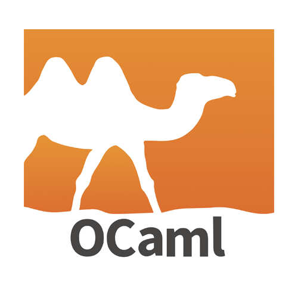

# Hi there, I'm Antonio 👋

- 🔭 I’m currently a student at the University of Maryland majoring in Computer Science & Mathematics!
- 🌱 I’m working on a personal side project which I am exited to share soon!
- 👯 I’m looking to collaborate with other people in fun projects!
- ⚡ Fun fact: I love to code 🤣

---

## 📕 Languages and Technologies 📕

Year 2021

<h4 style>Languages</h4>

<h4>Technologies</h4>

<h4>Tools & Other</h4>

Year 2020

<h4 style>Languages</h4>

 

<h4>Technologies</h4>

<h4>Tools & Other</h4>

---

[][linkedin]

[linkedin]: https://www.linkedin.com/in/antonio-p-523127180/
